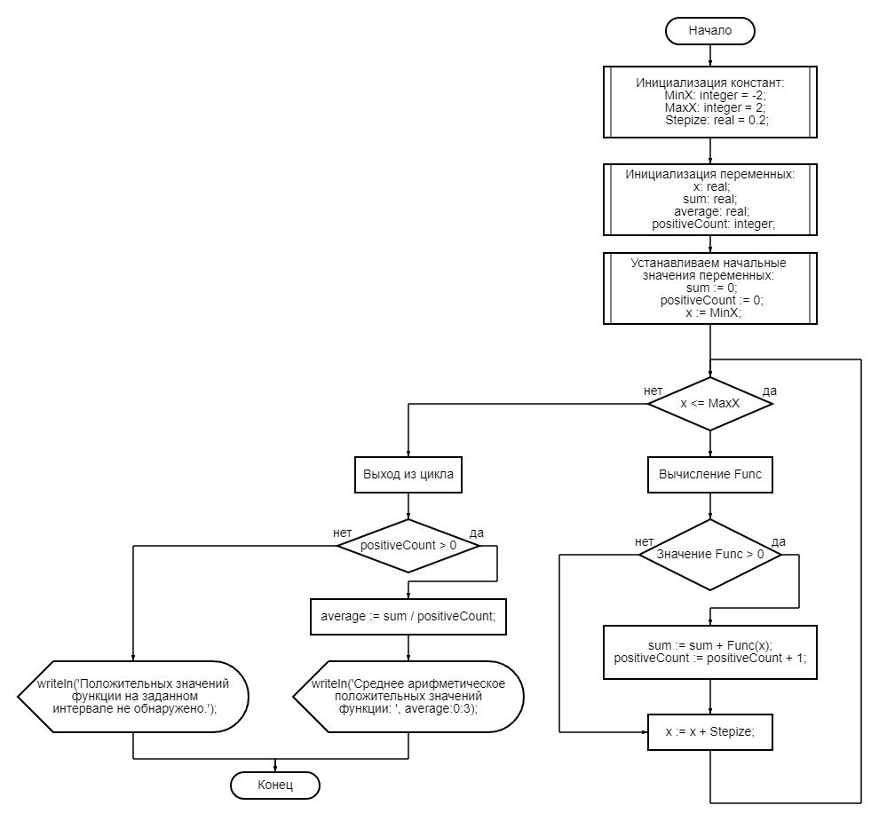
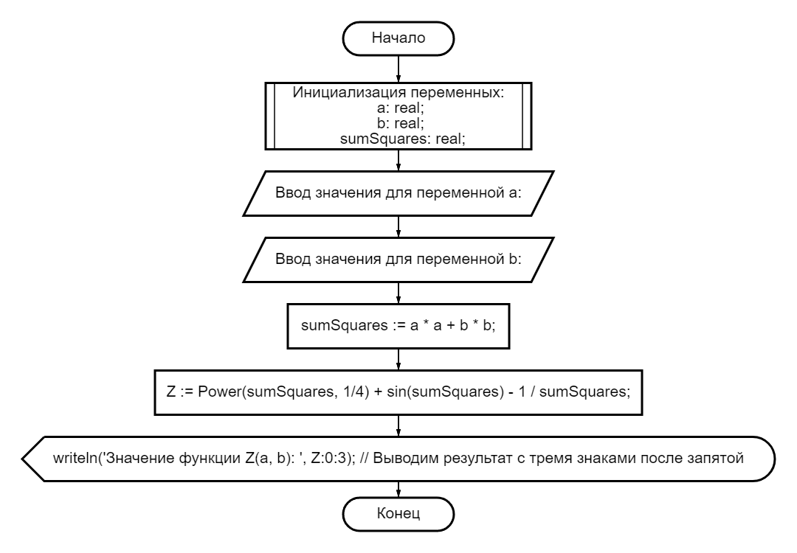

# Задание 1

## 1

В Pascal, циклический процесс — это выполнение определенного блока кода повторно несколько раз, пока не будет достигнуто определенное условие. Это осуществляется с помощью циклов.

**В Pascal есть три основных типа циклов для реализации таких процессов:**

- Цикл for - используется для повторения кода определенное количество раз.

  *Пример:*

  ```pascal
  for i := 1 to 10 do
    writeln('Повторение ', i);
  ```

- Цикл while - выполняет блок кода, пока условие истинно.

  *Пример:*

  ```pascal
  i := 1;
  while i <= 10 do
  begin
    writeln('Повторение ', i);
    i := i + 1;
  end;
  ```

- Цикл repeat...until - выполняет блок кода до тех пор, пока условие не станет истинным. В отличие от while, код внутри repeat выполнится хотя бы один раз, даже если условие изначально ложно.

  *Пример:*

  ```pascal
  i := 1;
  repeat
    writeln('Повторение ', i);
    i := i + 1;
  until i > 10;
  ```

## 2

Параметр цикла — это переменная, значение которой изменяется с каждым новым проходом цикла в пределах заданных границ. Изменение этого параметра происходит автоматически по определенному правилу, заданному в условиях цикла. Параметр цикла используется для контроля количества итераций цикла и обычно служит индексом для доступа к элементам массивов или для выполнения повторяющихся операций определенное количество раз

```pascal
var
  i: Integer;
begin
  for i := 1 to 5 do
    writeln('Итерация №', i);
end.
```

## 3

```pascal
program SumOfNumbers;

var
  sum: integer;
  i: integer;
  N: Integer;

begin
  sum := 0; // Инициализация суммы
  writeln('Введите число N: ');
  readln(N); // Чтение значения N

  for i := 1 to N do
    sum := sum + i; // Добавление значения i к сумме на каждой итерации

  writeln('Сумма чисел от 1 до ', N, ' равна ', sum);
end.
```

## 4

Основное отличие между операторами цикла с предусловием (while) и постусловием (repeat...until) заключается в моменте проверки условия выполнения цикла

**Цикл while (с предусловием):**

- Условие проверяется до выполнения тела цикла.
- Если условие ложно с самого начала, тело цикла не будет выполнено ни разу.
- Это означает, что выполнение цикла начинается только после того, как подтверждено, что условие истинно.

*Пример использования:*

```pascal
var
  i: Integer;
begin
  i := 10;
  while i > 0 do
  begin
    writeln(i);
    i := i - 1;
  end;
end;
```

В этом примере, цикл будет выполняться, пока i больше 0. Если i изначально будет 0 или меньше, тело цикла не выполнится ни разу.

**Цикл repeat...until (с постусловием):**

- Условие проверяется после выполнения тела цикла, поэтому тело цикла выполнится хотя бы один раз, даже если условие изначально ложно.
- Цикл продолжается до тех пор, пока условие не станет истинным.

*Пример использования:*

```pascal
var
  i: Integer;
begin
  i := 10;
  repeat
    writeln(i);
    i := i - 1;
  until i = 0;
end;
```

## 5

1. S = 9
2. S = 8
3. S = 3
4. S = 10

# Задание 2

*Код программы:*

```pascal
program AveragePositiveValues;

const
    MinX: integer = -2;
    MaxX: integer = 2;
    Stepize: real = 0.2;

var
  x: real;
  sum: real; 
  average: real;
  positiveCount: integer;

function Func(x: Real): Real;
begin
  Func := Power(x, 3) + Power(cos(x), 4);
end;

begin
  sum := 0;
  positiveCount := 0;
  x := MinX;
  while x <= MaxX do
  begin
    if Func(x) > 0 then
    begin
      sum := sum + Func(x);
      positiveCount := positiveCount + 1;
    end;
    x := x + Stepize;
  end;

  if positiveCount > 0 then
  begin
    average := sum / positiveCount;
    writeln('Среднее арифметическое положительных значений функции: ', average:0:3);
  end
  else
    writeln('Положительных значений функции на заданном интервале не обнаружено.');
end.
```

*Результат выполнения:*

```text
Среднее арифметическое положительных значений функции: 2.107
```

*Блок схема:*

*[Сайт](https://programforyou.ru/block-diagram-redactor) где можно открыть блок-схемы*

*Блоксхемы находятся в директории <ins>**./flowcharts***</ins>

# Задание 3

## 1

*Код программы:*

```pascal
program CalculateFunctionZ;

var
  a: real;
  b: real;
  Z: real;
  sumSquares: real;

begin
  writeln('Введите значение для переменной a:');
  readln(a);
  writeln('Введите значение для переменной b:');
  readln(b);
  
  sumSquares := a * a + b * b;
  
  Z := Power(sumSquares, 1/4) + sin(sumSquares) - 1 / sumSquares;
  
  writeln('Значение функции Z(a, b): ', Z:0:3);
end.
```

*Результат выполнения:*

```text
Введите значение для переменной a:
1
Введите значение для переменной b:
2
Значение функции Z(a, b): 0.336
```

## 2

*Блок схема:*

*[Сайт](https://programforyou.ru/block-diagram-redactor) где можно открыть блок-схемы*

*Блоксхемы находятся в директории <ins>**./flowcharts***</ins>
